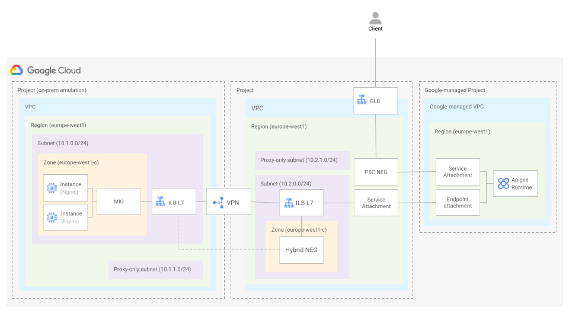

# Apigee X - Northbound GLB with PSC Neg, Southbouth PSC with ILB (L7) and Hybrid NEG

The following example shows how to expose an on-prem target backend to clients in the internet.

The architecture is the one depicted below.



To emulate an service deployed on-premise, we have used a managed instance group of instances running Nginx exposed via a regional internalload balancer (L7). The service is accesible through VPN.

## Running the blueprint

1. Clone this repository or [open it in cloud shell](https://ssh.cloud.google.com/cloudshell/editor?cloudshell_git_repo=https%3A%2F%2Fgithub.com%2Fterraform-google-modules%2Fcloud-foundation-fabric&cloudshell_print=cloud-shell-readme.txt&cloudshell_working_dir=blueprints%2F%apigee%2F/network-patterns/nb-glb-psc-neg-sb-psc-ilbl7-hybrid-neg), then go through the following steps to create resources:

2. Copy the file [terraform.tfvars.sample](./terraform.tfvars.sample) to a file called ```terraform.tfvars``` and update the values if required.

3. Initialize the terraform configuration

    ```terraform init```

4. Apply the terraform configuration

    ```terraform apply```

Once the resources have been created, do the following:

Create an A record in your DNS registrar to point the environment group hostname to the public IP address returned after the terraform configuration was applied. You might need to wait some time until the certificate is provisioned.

## Testing the blueprint

Do the following to verify that everything works as expected.

<!-- BEGIN TFDOC -->

## Variables

## Outputs

<!-- END TFDOC -->
