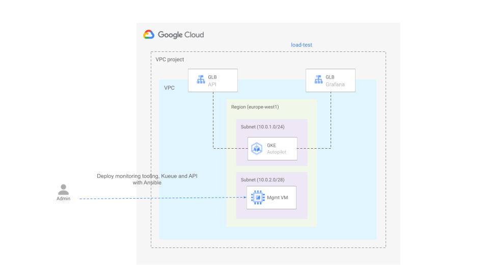

# Deploy a batch system using Kueue

This blueprint shows you how to deploy a batch system using Kueue to perform Job queueing on Google Kubernetes Engine (GKE). 

The example deploys microservice exposing an endpoint that can be leveraged to scrape a collection in the [Internet Archive](https://archive.org/) and download all the files of a particular format to a GCS bucket. When the endpoint is invoked a job is scheduled. This job will be scheduling one job per file to be downloaded.

The diagram below depicts the architecture.



## Running the blueprint

1. Clone this repository or [open it in cloud shell](https://ssh.cloud.google.com/cloudshell/editor?cloudshell_git_repo=https%3A%2F%2Fgithub.com%2Fterraform-google-modules%2Fcloud-foundation-fabric&cloudshell_print=cloud-shell-readme.txt&cloudshell_working_dir=blueprints%2Fgke%2Fautopilot), then go through the following steps to create resources:

2. Initialize the terraform configuration

    ```
    terraform init
    ```

3. Apply the terraform configuration

    ```
    terraform apply -var project_id=my-project-id
    ```

4. Copy the IP addresses for the API and grafana and the name of the bucket.    

5. Change to the ansible directory and run the following command

    ```
    ansible-playbook -v playbook.yaml
    ```

6. Invoke the API to scrape a collection and download the files in it:

    ```
    curl -v -H'Content-type: application/json' -d'{"bucket": "<BUCKET>", "collection": "<COLLECTION>", "format": "<FORMAT>"}' http://[API_IP_ADDRESS]/downloads
   ```

7. Open grafana in your browser and go to the Kueue dashboards to monitor the activity in the cluster.


Alternatively you can also check all the above using the dashboards available in grafana.
<!-- BEGIN TFDOC -->

## Variables

| name | description | type | required | default |
|---|---|:---:|:---:|:---:|
| [project_id](variables.tf#L78) | Project ID. | <code>string</code> | ✓ |  |
| [cluster_network_config](variables.tf#L17) | Cluster network configuration. | <code title="object&#40;&#123;&#10;  nodes_cidr_block              &#61; string&#10;  pods_cidr_block               &#61; string&#10;  services_cidr_block           &#61; string&#10;  master_authorized_cidr_blocks &#61; map&#40;string&#41;&#10;  master_cidr_block             &#61; string&#10;&#125;&#41;">object&#40;&#123;&#8230;&#125;&#41;</code> |  | <code title="&#123;&#10;  nodes_cidr_block    &#61; &#34;10.0.1.0&#47;24&#34;&#10;  pods_cidr_block     &#61; &#34;172.16.0.0&#47;20&#34;&#10;  services_cidr_block &#61; &#34;192.168.0.0&#47;24&#34;&#10;  master_authorized_cidr_blocks &#61; &#123;&#10;    internal &#61; &#34;10.0.0.0&#47;8&#34;&#10;  &#125;&#10;  master_cidr_block &#61; &#34;10.0.0.0&#47;28&#34;&#10;&#125;">&#123;&#8230;&#125;</code> |
| [kueue_version](variables.tf#L37) | Kueue version | <code></code> |  | <code>v0.2.1</code> |
| [mgmt_server_config](variables.tf#L42) | Management server configuration. | <code title="object&#40;&#123;&#10;  disk_size     &#61; number&#10;  disk_type     &#61; string&#10;  image         &#61; string&#10;  instance_type &#61; string&#10;&#125;&#41;">object&#40;&#123;&#8230;&#125;&#41;</code> |  | <code title="&#123;&#10;  disk_size     &#61; 50&#10;  disk_type     &#61; &#34;pd-ssd&#34;&#10;  image         &#61; &#34;projects&#47;ubuntu-os-cloud&#47;global&#47;images&#47;family&#47;ubuntu-2204-lts&#34;&#10;  instance_type &#61; &#34;n1-standard-2&#34;&#10;&#125;">&#123;&#8230;&#125;</code> |
| [mgmt_subnet_cidr_block](variables.tf#L58) | Management subnet IP CIDR range. | <code>string</code> |  | <code>&#34;10.0.2.0&#47;24&#34;</code> |
| [project_create](variables.tf#L64) | Parameters for the creation of the new project. | <code title="object&#40;&#123;&#10;  billing_account_id &#61; string&#10;  parent             &#61; string&#10;&#125;&#41;">object&#40;&#123;&#8230;&#125;&#41;</code> |  | <code>null</code> |
| [prometheus_operator_version](variables.tf#L73) | Kueue version | <code></code> |  | <code>v0.64.0</code> |
| [region](variables.tf#L83) | Region. | <code>string</code> |  | <code>&#34;europe-west1&#34;</code> |
| [vpc_create](variables.tf#L89) | Flag indicating whether the VPC should be created or not. | <code>bool</code> |  | <code>true</code> |
| [vpc_name](variables.tf#L95) | VPC name. | <code>string</code> |  | <code>&#34;vpc&#34;</code> |

## Outputs

| name | description | sensitive |
|---|---|:---:|
| [bucket_name](outputs.tf#L22) | Bucket name. |  |
| [urls](outputs.tf#L17) | URLs. |  |

<!-- END TFDOC -->
## Test

```hcl
module "test" {
  source = "./fabric/blueprints/gke/hpc"
  project_create = {
    billing_account_id = "12345-12345-12345"
    parent             = "folders/123456789"
  }
  project_id = "my-project"
}
# tftest modules=13 resources=41
```